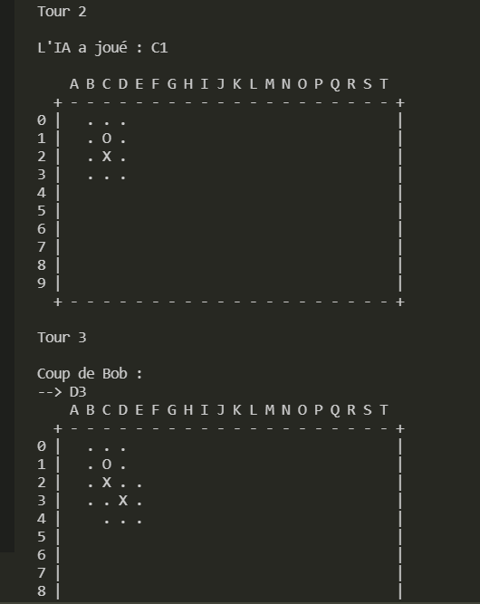
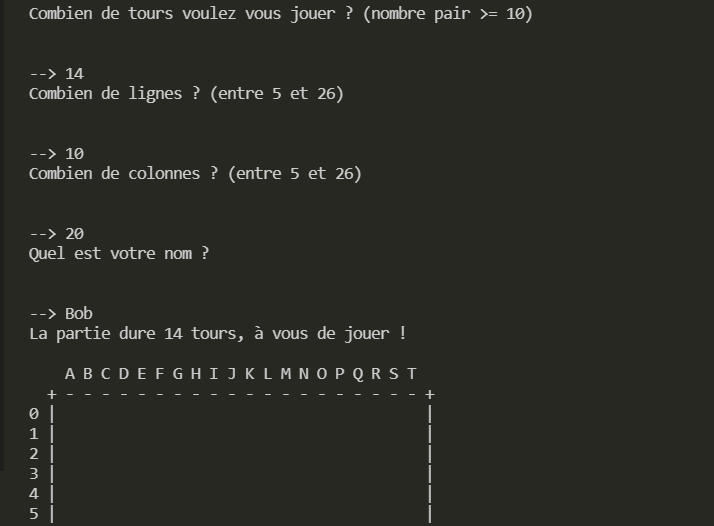

# Gomoku

In this game you can play against a bot or against a human, the one who lines up 5 pieces side by side has won.

You will find a detailed report above, renamed "rapport.pdf" (in French).

Breakdown between classes

Our main() method is found in the Game class. This class allows you to create an instance of the party class from the menuPrincipal() method.A game consists of two players and a board, among other attributes necessary for the progress of a game.
Player is an abstract class, mother of two classes: JoueurHumain and JoueurIA, having in common the abstract method play(). JoueurIA generates hits in this method, which it will send in the Part class. JoueurHumain itself grabs the hits it wants to play.
A Tray consists, among other things, of a double table of Case. A box has several properties, including coordinates. The Coordinates class is used for the association of a row and a column in the tray, and to facilitate the use of a Case. This class is needed to find neighbouring coordinates with the help of the Direction class.

Choices made

We tried to create a coherent code using the concepts learned in class: abstract classes, ArrayList, recursiveness, exceptions and obviously unit tests.
We did not create a collection. Although we wanted to apply all the new concepts learned, we did not find it useful to use a collection in this situation.

